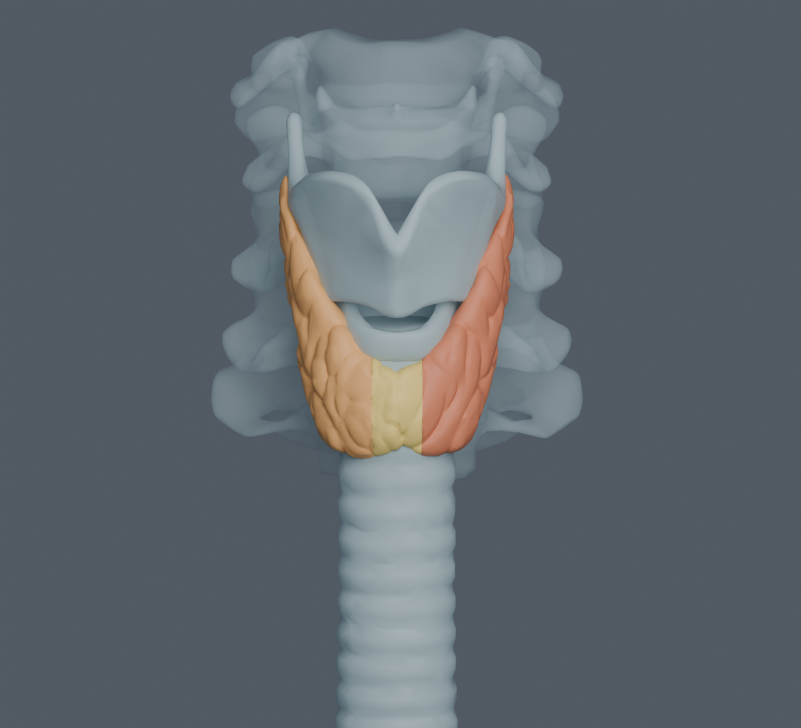
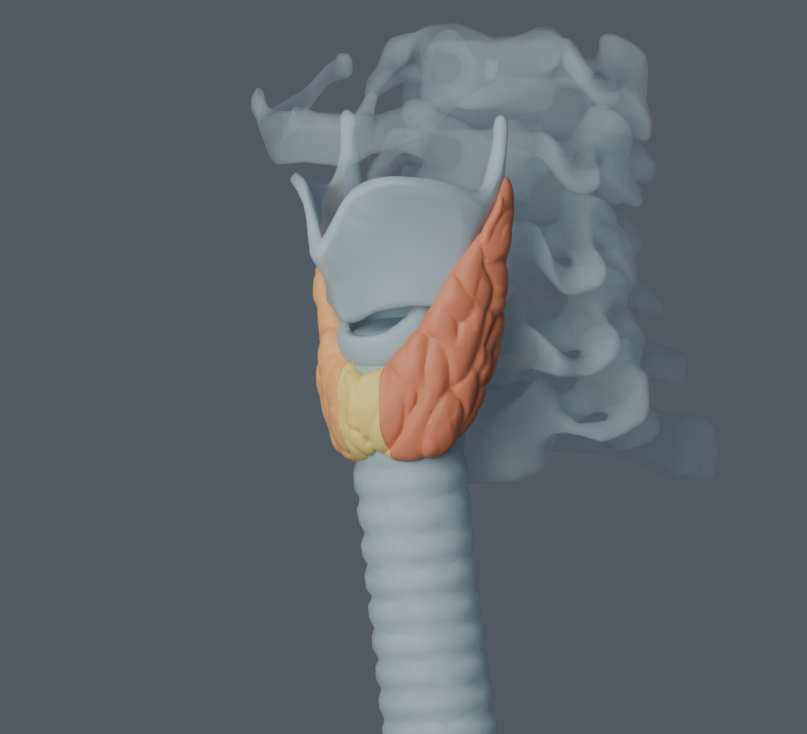
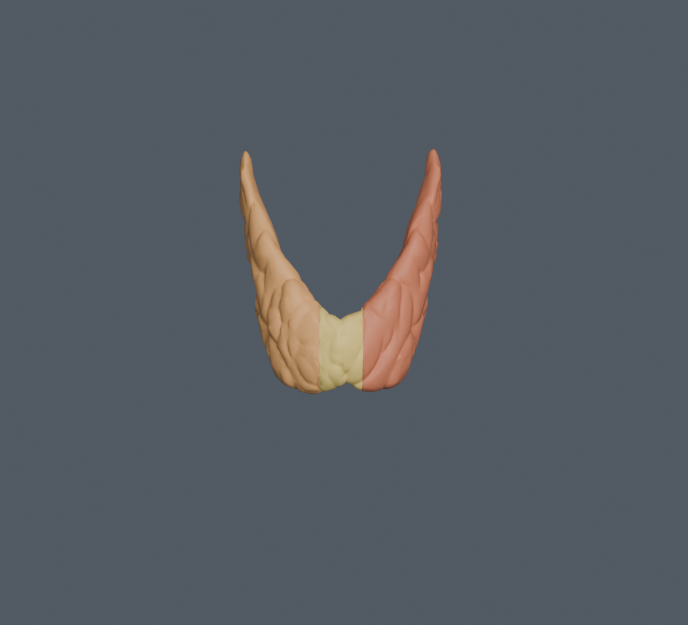

# BodyParts3D 4.3 tiroid adayı — kaynak ve yerleşim incelemesi

2026-09-22. **Somut alternatif bulundu ve ayrı paket olarak üretildi.** Aday iki lob ve ayrı isthmus yüzeyi içeriyor. Mevcut Z-Anatomy `thyroid.*` paketine ve aktif extension kaydına dokunulmadı. Anatomik uzman kabulü bekliyor; tüm normal tiroid çeşitliliğini veya klinik segmentasyon doğruluğunu temsil ettiği ileri sürülmüyor.

## Kaynak ve kimlik

HRA resmi reference-object-library ana ağaç envanterinde tiroid adına rastlanmadı. Z-Anatomy kaynak dosyasında ikinci ayrıntılı tiroid yüzeyi bulunmadı; isthmus/lob işaretleri yalnız çizgi/etiket niteliğindeydi. Resmi BodyParts3D 1/2/3 arşiv listelerindeki tiroid kıkırdağı, tiroid bezi yerine alınmadı. Kullanılabilir üç yüzey, **canlı BodyParts3D 4.3** veri kümesinden indirildi.

- [Resmi canlı kaynak](https://lifesciencedb.jp/bp3d/?lng=en)
- [4.3 FMA→geometri eşlemesi](https://lifesciencedb.jp/bp3d/get-info.cgi?version=4.3&cmd=concept-objfiles-list)
- [Canlı kaynak lisansı](https://lifesciencedb.jp/bp3d/info_en/license/index.html): CC BY-SA 2.1 Japan. Farklı arşiv sitesinin CC BY 4.0 ifadesi bu dosyalara varsayımla uygulanmadı.

Üç OBJ kaynak ZIP içinde saklandı; başlıklardaki kaynak adları ve konsept ID’leri resmi FMA2Obj.txt ile uzlaştırıldı. FMA9603 part_of = FJ3670 + FJ3671 + FJ3672. Üçüncü taraf envanterdeki üst konseptler/yanlış FMA eşlemeleri aktarılmadı.

| Kaynak | Resmi konsept | Yüzey | Üçgen | Ham köşe | Tekil konum |
|---|---|---|---:|---:|---:|
| FJ3671 | FMA13369 | Left lobe of thyroid gland | 4741 | 14223 | 2440 |
| FJ3672 | FMA13368 | Right lobe of thyroid gland | 5061 | 15183 | 2614 |
| FJ3670 | FMA49178 | Isthmus of thyroid gland | 1746 | 5238 | 968 |

## Yerleşim ölçümü

Yeni fit uygulanmadı. Ana atlasın dönüşümü aynen kullanıldı: `(x,y,z)mm → (x/1000, z/1000+0.0781112, -y/1000-0.1)m`. Dokuz bağımsız aynı-ID boyun yüzeyi yeniden resmi kaynaktan indirildi. Çift yönlü en yakın üçgen yüzeyi uzaklığı ölçüldü; bunlar fit noktaları değildir. Ana atlasın sadeleştirilmiş yüzeyleri ile kaynak arasındaki RMS 0,007–0,081 mm; en büyük mesafe 0,357 mm. Bu, koordinat uyumunu destekler; tıbbi uzman değerlendirmesinin yerine geçmez.

| Referans | RMS (mm) | %95 (mm) | Maksimum (mm) |
|---|---:|---:|---:|
| Seventh cervical vertebra (FJ3172) | 0.0200 | 0.0270 | 0.1643 |
| Trachea (FJ2541) | 0.0813 | 0.1935 | 0.3571 |
| Sixth cervical vertebra (FJ3170) | 0.0218 | 0.0498 | 0.1785 |
| Cricoid cartilage (FJ2440) | 0.0071 | 0.0040 | 0.0577 |
| Fourth cervical vertebra (FJ3164) | 0.0167 | 0.0249 | 0.1269 |
| Third cervical vertebra (FJ3161) | 0.0163 | 0.0061 | 0.1446 |
| Thyroid cartilage (FJ2808) | 0.0195 | 0.0624 | 0.1013 |
| Fifth cervical vertebra (FJ3167) | 0.0147 | 0.0000 | 0.1602 |
| Hyoid bone (FJ3201) | 0.0135 | 0.0230 | 0.1218 |

## Görsel ve yüzey yeterliliği

Gerçek atlas hyoid, tiroid/cricoid kıkırdak, trakea ve C3–C7 yüzeyleriyle ön/oblik/arka görüntüler üretildi; ayrıca yalnız aday görüntülendi. Ön ve oblik görsel inceleme: iki lob larinksin yanlarında ve trakeanın üst kısmı çevresinde uzanıyor; ayrı isthmus önde altta lobları birleştiriyor. Önceki ince kalkan benzeri tek yüzeyden farklı, hacimli ayrı loblar görülüyor. Lob yüzeyleri belirgin biçimde engebeli; bu kaynak morfolojisidir, ek subdivision ile üretilmiş ayrıntı değildir.

Birleşik ölçülen sınırlar yaklaşık 41,2 mm genişlik × 49,9 mm yükseklik × 21,1 mm ön-arka kalınlık. Bu sayılar bu referans modelinin ölçümleridir; normal anatomik aralık iddiası değildir. Pyramidal lob, paratiroidler, damarlar, sinirler, kapsül/fasya ve lobüllerin etiketli iç yapısı dahil değildir.

Kaynak OBJ’ler üçgen başına yinelenmiş köşeler içeriyor. Paket bu pozisyon/üçgenleri korur. Yalnız görüntü normalleri tam aynı konumdaki köşeler arasında hesaplanır. Tam konum birleştirmesi ile ölçülen açık sınır kenarları sol lob 263, sağ lob 323, isthmus 366; >2 yüzlü kenar yok. **Kapalı manifold/3D baskı/boole hazır organ iddiası yoktur.** İmzalı yüzey hacmi integralleri manifestte yalnız geometri tanısıdır; açık yüzeyler nedeniyle klinik organ hacmi sayılmaz. Delik kapatma veya anatomik biçim düzeltmesi yapılmadı.

## Paket ve doğrulama

`public/models/extensions/thyroid-bp3d43.json`, `.bin`, `.bin.gz`; ayrı `THYROID-BP3D43-ATTRIBUTION.md`. Kaynakların kendisi `data/model-candidates/thyroid-bp3d43/` altında, tekrar üretici `scripts/export-thyroid-bp3d43.py`. Paket aktif kayıt listesine eklenmemiştir.

- 3 parça, 11,548 üçgen; ham binary 762,172 bayt; gzip 241,625 bayt.
- Binary SHA-256: `3ded7c49d98ffc389315a04dd65e9ce2bc34c0f6304553b5a090fd22efc8cc49`.
- İki üretimde binary aynı kaldı. Float32 sonlu konumlar, Int16 birim normaller, indeks sınırları, tam bounds, 4-bayt hizalama, veri aralıklarının çakışmaması ve gzip roundtrip bağımsız kontrol edildi.
- Blender `--disable-autoexec` ile çalıştırıldı. Yüzeyler yeniden şekillendirilmedi veya sadeleştirilmedi.
- Ana atlas hash kontrolü exporter içinde sabit; mevcut thyroid dosyaları, app/graph/coverage/index/sources değiştirilmedi.

Kalıcı görseller (CC BY-SA 2.1 Japan, yukarıdaki DBCLS atfıyla):

## Uygulama entegrasyonu

22 Eylül: Root tarafından ön görüntü yeniden incelendi; paket kaynak referansı olarak aktif extension kaydına eklendi. Üç kaynak OBJ için provenance alanları (`sourceObject`, `sourceObjectType=OBJ`) ve gzip yükleme alanı standartlaştırıldı, exporter tekrar çalıştırıldı. FMA9603 bütün bez seçimini; FMA13369/FMA13368/FMA49178 tekil lob ve isthmus seçimini sağlar. Kaynak eşlemesinden üç `part_of` bağlantısı ve çok dilli etiketler eklendi. Anatomik uzman kabulü bekliyor. Önceki Z-Anatomy stilize tiroidi aktif sahneye alınmadı.
