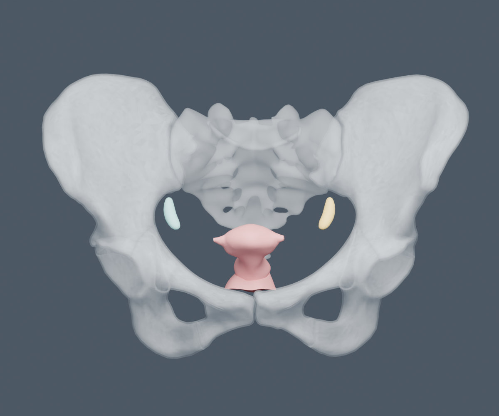
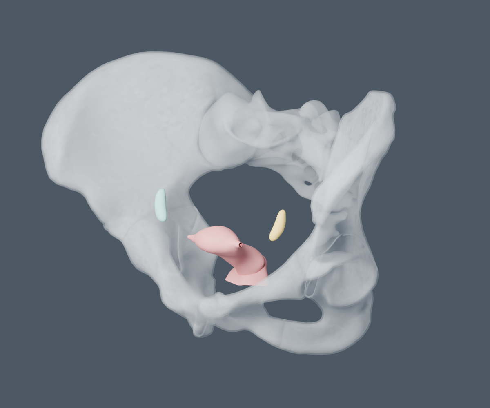
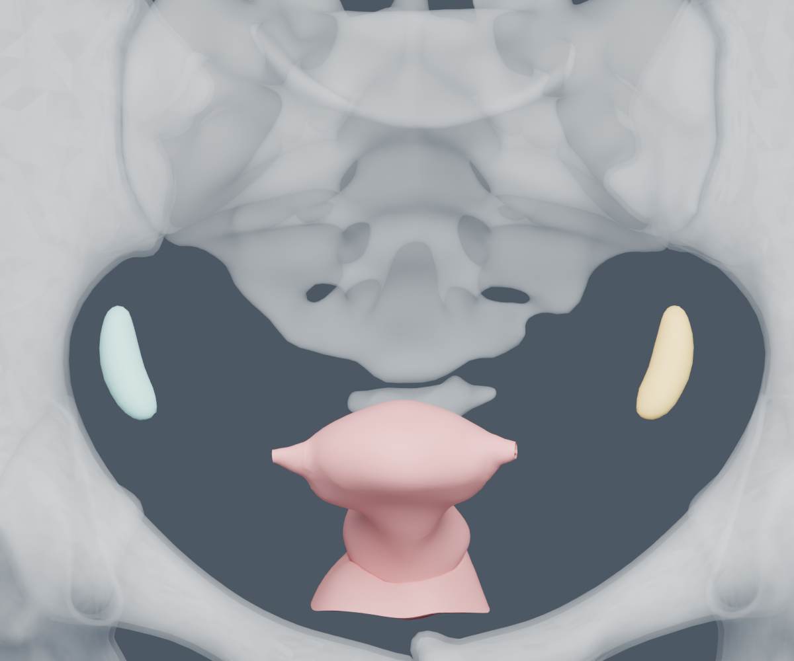

# Ayrı kadın pelvis referansı — HRA kaynak incelemesi

2026-09-22. **Uterus, sağ/sol ovaryum ve kemik pelvis içeren somut ayrı referans paketi hazır.** Orijinal GLB’ler ve 27 yüzeyli manifest/binary aday `data/model-candidates/female-pelvis/` altında saklandı. Erkek atlasa yerleştirme veya ortak uygulama kaydında değişiklik yapılmadı.

## Mevcut ve güncel kaynaklar

Önceden indirilen HRA GitHub v1.2 klasöründeki uterus 10 mesh / 37.184 üçgen, sol ovaryum 1 mesh / 424 üçgendi. Bu klasör sürümü, güncel HRA dijital nesnelerin bağımsız sürüm numarasıyla aynı anlamda kullanılmadı. Resmi GitHub main tree envanteri ve dört resmi dijital nesnenin `latest/metadata.json` uçları incelendi; çözümlenen sürümler `release-inventory.json` içinde kaydedildi.

| Seçilen kaynak | Dijital nesne sürümü | Mesh / üçgen | DOI |
|---|---|---:|---|
| uterus-female | v1.2 | 11 / 40,950 | [HBM627.VTKD.892](https://doi.org/10.48539/HBM627.VTKD.892) |
| ovary-female-left | v1.3 | 1 / 424 | [HBM695.KCXS.294](https://doi.org/10.48539/HBM695.KCXS.294) |
| ovary-female-right | v1.3 | 1 / 410 | [HBM277.TVMB.676](https://doi.org/10.48539/HBM277.TVMB.676) |
| pelvis-female | v1.3 | 14 / 87,448 | [HBM853.VCFM.778](https://doi.org/10.48539/HBM853.VCFM.778) |

Güncel uterus dosyasında ayrıca cervicovaginal junction bulunuyor; tam dosya 11 yüzey, `VH_F_uterus` ana alt ağacı ise 10 yüzey içeriyor. Kaynak aggregate kavramına fazladan bağlantı yüzeyi eklenmedi. Kaynakta kullanılan “abdominal ostium”, “lower uterine segment” gibi etiketler özgün halleriyle korunuyor; bu iş yeni terminoloji doğrulaması yapmıyor.

Sağ ovaryum kendi resmi GLB dosyasından geldi: `VH_F_right_ovary`, kaynak FMA7213, 410 üçgen. Sol ovaryum `VH_F_left_ovary`, FMA7214, 424 üçgen. Yüzey sayıları ve konumları farklı; sağ geometri bu çalışmada solun aynasından üretilmedi. İki GLB de değişmeden saklandı.

## Cinsiyet, donör ve koordinat sistemi

Dört graph kaydında `organ_owner_sex=Female`; her global placement hedefi `https://purl.humanatlas.io/graph/hra-ccf-body#VHFemale`. GLB mesh extras alanlarında ortak `source_spatial_entity=#VHFemaleOrgans` var. Seçilen GLB node dönüşümleri identity; native metre/Y-up konumlar aynen tutuldu. Organ başına yeniden merkezleme, ICP, ölçek düzeltmesi veya aynalama yok.

Metadata kaynağı Visible Human Dataset / National Library of Medicine olarak tanımlıyor; **bireysel donör ID’si vermiyor**. Ortak referans montajı doğrulanmış olsa da bütün organların tek bireyin taramasından geldiği bu kayıtlarla kesinleştirilmiş değildir. Dört dijital nesne bağımsız sürümlüdür; sürüm farkı gizlenmedi. Tarihsel uterus v1.1 açıklamasında “Visible Human Male” metni vardı; seçilen v1.2 metadata bunu genel Visible Human Dataset olarak ifade ediyor. Eski çelişkili açıklama güncel kadın donör kimliği kanıtı yapılmadı.

HRA graph içindeki object-placement X=-90° ve yerel öteleme kayıtları da manifestte korunuyor; native glTF çıktısına ikinci kez uygulanmadı. Aşağıdaki karşılaştırma, graph’ın `file_subpath` ana nesnesiyle yapıldı. Uterus dosyasının ayrı junction yüzeyi ana nesnenin bbox’ına dahil edilmedi.

| Nesne | Kaynak primary ölçüleri x/y/z (mm) | Graph farkı en fazla (mm) |
|---|---|---:|
| uterus-female | 52.488 / 46.993 / 58.696 | 0.00000191 |
| ovary-female-left | 12.277 / 23.947 / 10.534 | 0.00000176 |
| ovary-female-right | 12.310 / 23.987 / 10.628 | 0.00000161 |
| pelvis-female | 316.838 / 211.493 / 182.744 | 0.00002914 |

Boyut uyuşması ölçek/koordinat kontrolüdür; tek başına klinik doğruluk ölçümü değildir. Ön, oblik ve yakın renderlar incelendi: iki ovaryum uterusun karşı taraflarında, organlar aynı kadın pelvis çerçevesinin içinde görülüyor. Kemikler referans bağlamıdır; pelvis tabanı kasları ve diğer yumuşak dokular eklenmedi.

## Kapsam ve açık sınırlar

- 11 uterus dosyası yüzeyi, iki bağımsız ovaryum ve 14 pelvis kemik/doku yüzeyi.
- Uterus source yüzey bölümleri, iç/dış oslar ve cervicovaginal junction korunur; bunların her biri kapalı bağımsız organ sayılmaz.
- Uterin tüpler, tam vagina, bağlar, damarlar, üriner mesane ve pelvis tabanı bu seçimde yok. Uterus dosyasındaki ostium etiketi tüm tüplerin varlığı anlamına gelmez.
- Kemik context kompakt/trabeküler doku olarak bölünmüş; kaynakta bazı alt yüzeylerin ontology ID’si yalnız genel kemik dokusunu gösteriyor. Bu yüzden tümünü aynı kavrama birleştirmek yerine node-scoped ID kullanıldı.
- Kapalı manifold, klinik hacim, patoloji/gebelik durumu veya tek bir “normal kadın” morfolojisi iddiası yok. Ayrı eğitim referansı için uzman kabulü bekliyor.

## Lisans ve tekrar üretim

Tüm seçilen metadata ve raw data kayıtları **CC BY 4.0** diyor. Kristen Browne ve Heidi Schlehlein kaynak yaratıcıları; HuBMAP/HRA yayıncı, NLM Visible Human kaynak dataset. Tam DOI atıfları ve değişiklik açıklaması paket içindeki `ATTRIBUTION.md` dosyasında. Uterus v1.2 metadata citation başlığındaki v1.1 ifadesi kaynak çelişkisi olarak korunuyor; dosya sürümü v1.2.

`scripts/export-female-pelvis-candidate.py` orijinal input hashlerini kontrol eder ve `--disable-autoexec` ile çalışır. Orijinal pozisyon/üçgenler değişmez. Source normaller birimleştirilir; anterior uterine wall içindeki yalnız iki çok küçük normal, incident yüzey normalinden veya dejenere durumda en yakın geçerli kaynak normalinden üretilir. Bu yalnız aydınlatma verisidir; geometri tam aynı kalır.

Aday: 27 parça, 66,496 köşe, 129,232 üçgen; 2,747,732 bayt binary, 1,593,059 bayt gzip. SHA-256 `04ab163b300eb3152955f44542cbdc9fc7612d9538b170cb30345b309f9d67f1`.

Bağımsız kontrol: 27 parçanın tüm Float32 pozisyon dizileri ve üçgen indeksleri orijinal GLB accessor’larıyla birebir eşleşiyor; sonlu konum, birim normal, indeks sınırı, bounds, hizalama, veri aralığı çakışmazlığı, ID tekilliği ve gzip açılımı geçti. Dört kaynak primary bbox değeri graph metadata ile 0,00003 mm altında uyuştu. Tekrar üretim aynı binary hashini verdi.

## Görsel kanıt

## Kapsam ve kaynak envanteriyle uzlaştırma — 22 Eylül

`data/anatomy/sources.json` içinde `reference-female-pelvis`, public `/models/female-pelvis/atlas.json` ve iki binary biçiminin gerçek SHA-256 değerlerini taşır. Dört ayrı HRA kaynak kaydında GLB hashleri, metadata/graph snapshotları, resmi DOI ve CC BY 4.0 bağlantıları korunur. Ana erkek atlas/knowledge grafiğine geometri veya kadın kavram kimliği eklenmedi.

Coverage uterus, sağ ve sol ovaryum hedefleri **ayrı kadın pelvis referansında mevcut** olarak kayıtlıdır. `currentBindings` boş; `datasetId: female-pelvis` ve `separateReference` ilgili kadın dataset kavramını gösterir. Uterus seçimi 10 kaynak primary yüzeyi kapsar. Bu üç satır yalnız kadın dataset sayımına eklenir; erkek atlasın mevcut geometri/target sayısı bu nedenle yükselmez.

Root yerel görsel kontrolünde 27 parçanın ortak bağlamı, uterusun 10 parçalı seçimi ve ghost davranışı çalışır görüldü. Bölgesel listedeki üç kadın hedefi ve uterus satırından ayrı kadın sahnesine geçiş gerçek arayüzde doğrulandı. Bu, yerel ürün kontrolüdür; anatomik uzman kabulü veya public deploy tamamlanması iddiası değildir.
