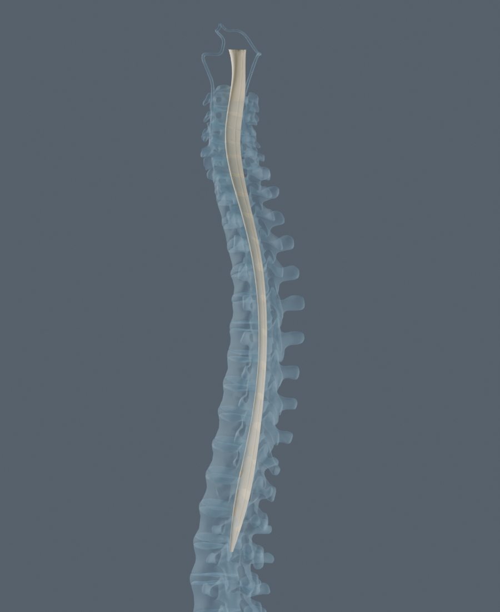

# Spinal cord surface recovered from official BodyParts3D 4.3

The official live 4.3 source supplies a longitudinal spinal cord neural-tissue surface missing from the current atlas. The concrete candidate and original source files are in `data/model-candidates/spinal-cord-bp3d43/`; the exporter and four rendered inspections are in `work/spinal-cord-review/`. No application assets, registry, coverage or canonical knowledge were changed by this review.

## Identity and source

The version-stamped official `FMA2Obj.txt` maps `FMA242005` (neural tissue of spinal cord) to `FJ4426`. Its `part_of` mapping for `FMA7647` (spinal cord) contains `FJ1737+FJ4426`. The old atlas's FMA7647 geometry contained only FJ1737, a central-canal component.

The [official live service](https://lifesciencedb.jp/bp3d/) was used to request FJ4426 and FJ1737 through `download.cgi`. The complete POST fields are preserved in `request.json`; the original response is `spinal-cord-bp3d43-source.zip`. Returned FJ4426 OBJ header identifies Compatibility version 4.3, representation BP29816, concept FMA242005, and Neural tissue of spinal cord. The reference catalog used BP29641; the server returned its part-of representation BP29816 for the same FJ4426 file. The returned OBJ and its digest, rather than a guessed filename, are the retained evidence.

The live [official license notice](https://lifesciencedb.jp/bp3d/info_en/license/index.html) states CC BY-SA 2.1 Japan with DBCLS attribution. Its snapshot and the mapping ZIP are retained. This candidate uses that license; the separate 4.0 archive's CC BY 4.0 designation is not applied to the live-source file. See the candidate's `ATTRIBUTION.md`.

## Geometry inspection

| Property | Neural tissue FJ4426 | Central canal FJ1737 |
| --- | ---: | ---: |
| Original OBJ bytes | 852,923 | 46,544 |
| Original vertices | 8,581 | 427 |
| Original triangles | 9,952 | 728 |
| Superior/inferior extent | 451.83 mm | 35.59 mm |
| Transverse bounding extent | 17.55 mm | 2.22 mm |

FJ4426 is one connected longitudinal tissue surface after exact-position welding. Its signed enclosed-volume estimate is 27.9488 cm³, closely matching the source header's 27.9493 cm³. Front and lateral renders show a long cord body with wider cervical/lower regions and a tapering inferior end. The vertebral-context render places it along the spinal canal. These are observations of the source mesh, not independent anatomical expert validation. It is not a marker, central canal, isolated internal horn or a single spinal segment.

The surface does not supply separately labeled spinal segments, gray/white matter, roots, meninges or a cauda equina. It addresses the missing longitudinal cord body; “complete” must not be used to imply those additional anatomical components are present.

Seven source triangles have zero area. The display export omits those and five now-unused vertices, yielding 8,576 vertices and 9,945 triangles. It preserves the original authored normals and all remaining source positions. After exact-position welding the derivative still has three boundary edges and three non-manifold edges, each no longer than 0.224 mm; two repeated source faces remain. No hole-filling or remeshing was used to hide these source defects. This is a usable visual surface candidate, not a watertight manufacturing/volumetric mesh claim.

## Coordinate verification and display package

The existing atlas conversion is used unchanged:

`atlas(x,y,z) = (source.x × 0.001, source.z × 0.001 + 0.0781112, −source.y × 0.001 − 0.1)`.

Independent source downloads were compared bidirectionally, vertex-to-triangle, against the same existing atlas parts. No transform was fitted.

| Reference | RMS discrepancy |
| --- | ---: |
| Fourth cervical vertebra, FJ3164 | 0.0167 mm |
| Sixth thoracic vertebra, FJ3171 | 0.0265 mm |
| Twelfth thoracic vertebra, FJ3156 | 0.0332 mm |
| First lumbar vertebra, FJ3157 | 0.0266 mm |
| Existing central canal, FJ1737 | 0.0272 mm |

The registration report is `work/spinal-cord-review/quality-registration.json`. Coordinate agreement supports the shared frame; it does not establish nerve-root attachments or validate every anatomical contour.

The staged manifest is `spinal-cord-bp3d43.json`, with one geometry part, `BP43-FJ4426`. Its binary is 273,708 bytes and its deterministic gzip is 156,120 bytes. Concepts are FMA242005 (source neural tissue) and FMA7647 (spinal cord). The latter must merge with the existing concept so FJ1737 remains in its geometry set. The manifest's public URLs are proposed integration destinations; these files currently exist only in the candidate directory.

The exporter is `work/spinal-cord-review/export-spinal-cord-bp3d43.py`; run it with Blender background mode and `--disable-autoexec`. It only writes the candidate/review directories. `checksums.json` records retained source and derived artifact digests. Rendered inspections are `isolated-front.png`, `isolated-lateral.png`, `vertebral-context.png` and `canal-comparison.png` in the review directory.

## Integration recommendation

Publish the retained attribution and candidate binary/manifest through the existing extension pipeline; pin the manifest hash and add its geometry-source record. Merge FMA7647 by ID, preserving central-canal geometry, and retain the distinct FMA242005 identity. Update the spinal-cord coverage claim to describe the longitudinal neural-tissue surface while keeping the absent segment/root/meningeal details explicit. The source topology limitations and pending expert review should stay attached to provenance. No generated branch, inferred attachment, or new relation is needed to render this recovered surface.

## Application integration

The root review accepted the longitudinal surface for the source-reference explorer, retaining the stated anatomical limits. `scripts/export-spinal-cord-bp3d43.py` now produces public extension files; `--render` additionally produces review images. The original candidate/source archive remains separate. The public manifest explicitly declares `extendsConceptIds: ["FMA7647"]`; the loader unions existing FJ1737 with BP43-FJ4426 and rejects undeclared concept collisions. The interaction validator exercises this preservation and rejection against actual registered assets. FMA242005 has its own source-backed part-of relation. UI labels and representation text describe the new surface without claiming roots, meninges or individually labeled segments.

Published attribution is `public/models/extensions/SPINAL-CORD-BP3D43-ATTRIBUTION.md`. The retained context image below is a CC BY-SA 2.1 Japan adaptation with DBCLS attribution, as recorded there.

